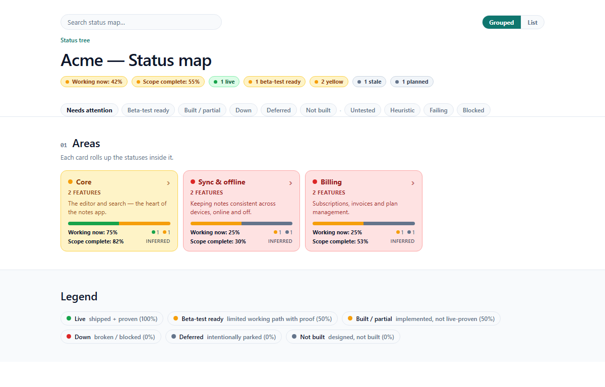
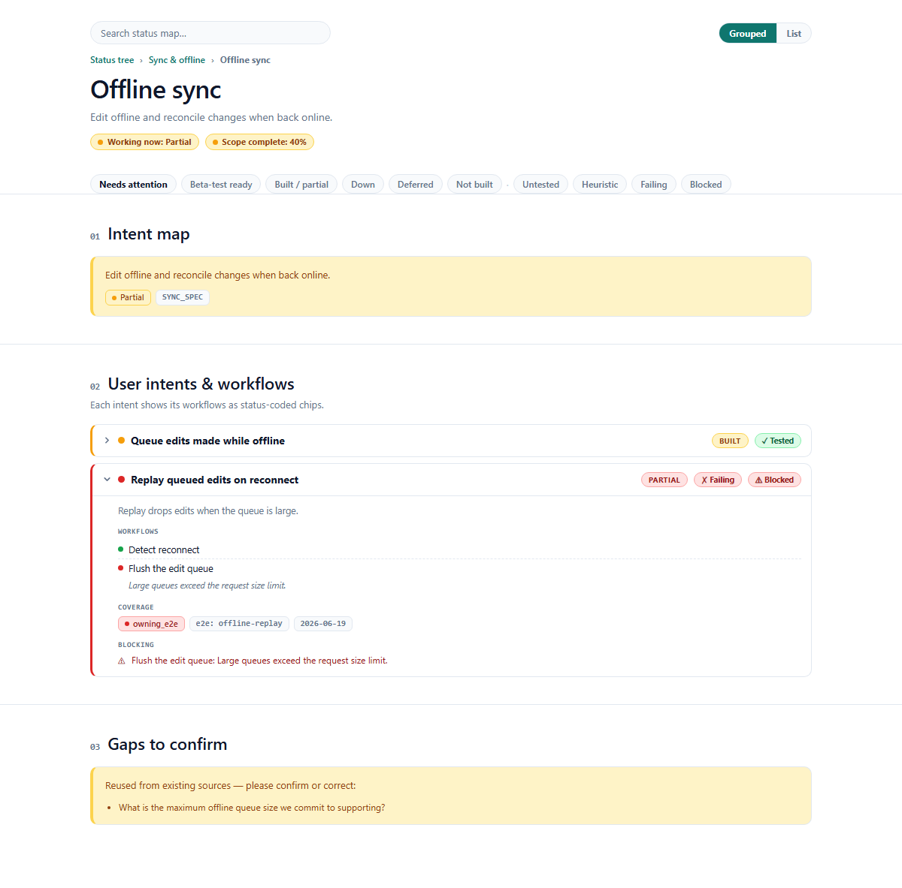
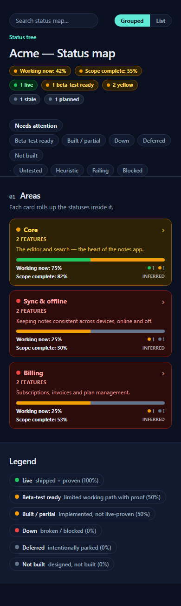

# statusmap

Turn plain YAML into an **honest, test-aware map of what your product can actually do**.
Planned work stays down, failing proof stays red, and every headline rolls up from the details beneath it.



Two packages:

| Package | What it is | Deps |
|---|---|---|
| [`@statusmap/core`](./packages/core) | Framework-agnostic TypeScript: the typed `StatusMapDefinition` contract, the status policy (health math, lifecycle/tone vocab, the proof-level ladder), the rollup engine, the YAML/JSON loaders, and the vitest/playwright test-artifact ingestion. | none (runtime) |
| [`@statusmap/vue`](./packages/vue) | A Vue 3 component family that renders a `StatusMapDefinition` — the masthead, the 8 section kinds, and the router-agnostic drill-down explorer. | `@statusmap/core`, `vue` (peers); `js-yaml` |

## Install

Install the renderer for a Vue app:

```bash
npm install @statusmap/vue @statusmap/core vue
```

Use the framework-agnostic core by itself:

```bash
npm install @statusmap/core
```

## Start with honest YAML

Create an area:

```yaml
# status/areas.yaml
- id: product
  label: Your product
  summary: 'Replace this with the part of your product this area owns.'
```

Then add a feature:

```yaml
# status/features/product/your-feature.yaml
id: your-feature
label: Your feature
areaId: product
lifecycle: planned
summary: 'Replace this with the user-visible outcome.'

intents:
  - id: primary-outcome
    label: Complete the main user outcome
    lifecycle: planned
    coverage:
      proofLevel: none
    workflows:
      - id: first-step
        label: Replace with the first real step
        lifecycle: planned

gaps:
  - 'What must be true before this can move from planned to beta?'
```

The starter is deliberately `planned` with `proofLevel: none`, so a new map cannot look green before the
work is real. Copy the [`starter-ledger`](./packages/core/examples/starter-ledger) or explore the richer
fictional [`Acme Notes ledger`](./packages/core/examples/ledger).

## Render it

```vue
<script setup lang="ts">
import { StatusMap } from '@statusmap/vue'
import '@statusmap/vue/styles.css'

const files = import.meta.glob('./status/**/*.yaml', { query: '?raw', import: 'default', eager: true })
</script>

<template>
  <StatusMap :files="files" brand="Acme" />
</template>
```

Expected file shape:

```text
status/
  areas.yaml
  features/<area>/<feature>.yaml
```

The same map drills into user outcomes, workflows, gaps, and failing-first test evidence:



The renderer is responsive and includes dark-mode tokens:



## Why it's different

Most status boards let you self-report green. This one is opinionated:

- **Honest health math** — `deferred` / `planned` / `not_built` resolve to `down` (0%),
  so a parent's "% up" is the *real* completeness of the product, not a vanity number.
- **Beta-test ready is explicit** — lifecycle `beta` means a limited real path is reachable and proven enough
  for beta users. Mock-only or PRD-only work stays planned.
- **The proof-level ladder** — `none → heuristic → unit → owning_e2e → destination`.
  A machine signal can *raise* proof at most to `owning_e2e`; it can never fabricate the
  human "I looked at it" `destination` level, and a failing run forces the status red.
- **Status derived from real test artifacts** — feed it vitest/jest JSON + playwright JSON
  and each intent gets a navigable, failing-first proof tree, not a hand-typed checkmark.

## Status

**v0.1 scope is `core` + `vue`.** The stable core entry point contains the definition and ledger contracts,
health/proof rules, generators, filters, loaders, and test-artifact ingestion. Experimental schema automation,
other framework renderers, a CLI/static exporter, and hosted services are not part of v0.1.

The Vue package supports Vue 3 with a Vite build using `@vitejs/plugin-vue`. Its runtime entry intentionally
ships as Vue/TypeScript source; generated declarations are included for editor and type resolution. A fresh
application is built from the packed tarballs in CI with no package-specific transpilation settings. CommonJS
and non-Vite bundlers are not a supported v0.1 contract.

## Development

This repository currently uses package-local npm projects rather than a root workspace.
Run commands from each package directory:

```bash
cd packages/core
npm ci
npm run build
npm test
npm run typecheck
npm run lint:pkg
npm run pack:dry

cd ../vue
npm ci
npm test
npm run typecheck
npm run build:types
npm run build:bundle
npm run lint:pkg
npm run pack:dry

cd ../..
node scripts/check-public-leaks.mjs
node scripts/verify-packed-consumer.mjs
```

`@statusmap/vue` exposes `@statusmap/core` as a public peer dependency and uses
the sibling package as a local dev dependency for repository checks. Build or
install the core package before running Vue bundle checks in a fresh checkout.

## CI

GitHub Actions runs the same package-local checks on pushes and pull requests:

- core: install, build, tests, typecheck, package lint, dry pack
- vue: install, tests, typecheck, declaration and bundle builds, package lint, dry pack
- release surface: public-tree leak scan and fresh Vite consumer build from both packed tarballs
- example: validate the self-roadmap ledger

## Release checklist

1. Follow [`RELEASING.md`](./RELEASING.md), including its clean-history and npm-scope gates.
2. Update [`CHANGELOG.md`](./CHANGELOG.md).
3. Run the CI-equivalent checks above from a clean release checkout.
4. Inspect both final tarballs and build the fresh packed consumer.
5. Publish `@statusmap/core` first, then `@statusmap/vue`.
6. Create a GitHub release that links the package versions and changelog entry.

## Contributing and security

Please read [`CONTRIBUTING.md`](./CONTRIBUTING.md) before opening a pull request.
Report vulnerabilities through the process in [`SECURITY.md`](./SECURITY.md).

## License

MIT. See [`LICENSE`](./LICENSE).
